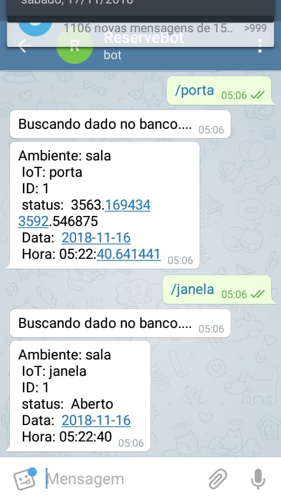
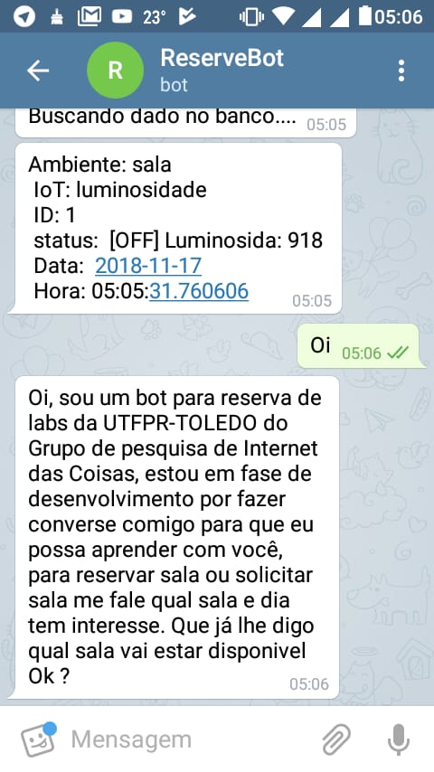

# Bot para Reserva de labs da UTFPR-TD e monitoramento de dados 
## Objetivo
* construir um bot para conversar com pessoas com interesse em reservar sala
* Monitorar o Ambiente com base nos parementros da problematica

## Prototipo com telegram
* Construir um chatbot para ler os dados salvos do IoT
* Prototipar um IoT bot para conversar com o usuario 

## Comandos

/porta  => dados de entrada e saida de pessoas na sala

/janela => leitura de as janelas estão abertas ou não

/luminosidade => ler dados de luz para saber se as luzes estão ligadas

## Print
| Image1 |              Image2      |
|--------------------------|---------|
| |   |

## Bibliotecas usadas
| Lib | Descrição |
|-----|-----------|
| time | tempo    |
| telepot | api telegram |
| numpt | calculo numerico |
| pamdas | data science | 

